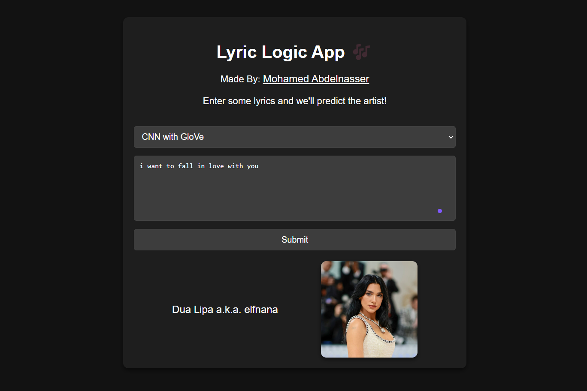
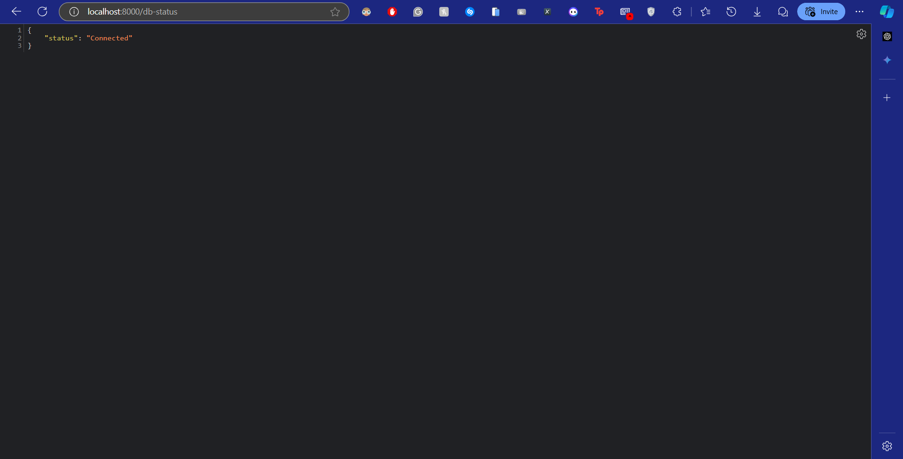
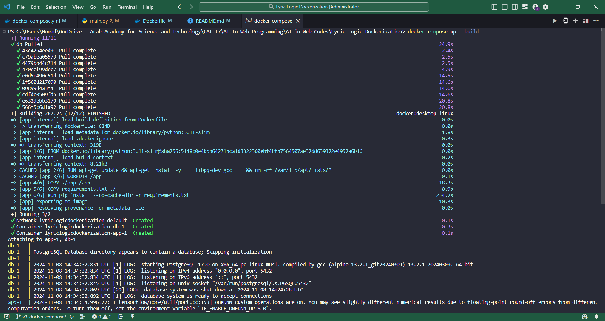
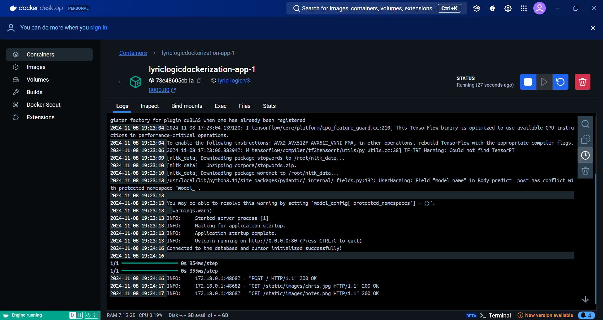
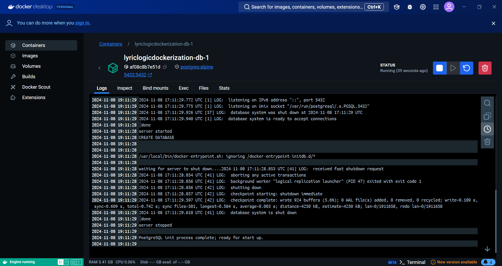

# Lyric Logic Dockerization

## Project Description

This project aims to build a Lyric Generation Model using Neural Networks based on the LSTM (Long Short-Term Memory) and CNN (Convolutional Neural Networks) models. Users can generate lyrics for songs in various genres, aligning with the course's focus on the practical implementation of Natural Language Processing (NLP) tasks.

## Version 3 - Dockerization (Docker-Compose (Lyric Logic Web App + Postgres:Alpine))

### Version Description

This repository contains the Dockerfile, docker-compose.yml, and other necessary files to build and run the Lyric Logic Web App and Postgres:Alpine database using Docker-Compose.

### File Structure

```
lyric-logic-dockerization
│   README.md
│   Dockerfile
│   docker-compose.yml
|   imgs
│   |   lyric_logic_web_page.png
|   |   build_docker_image.png
|   |   run_docker_container.png
|   |   run_docker_container_app.png
|   |   run_docker_container_postgres.png
│   |   db_status.png
│   requirements.txt
│   .dockerignore
│   .gitignore
|   app
|   |   main.py
|   |   models
|   |   |   cnn_glove.h5
|   |   |   cnn_learnable.h5
|   |   |   lstm_learnable.h5
|   |   |   tokenizer.pkl
|   |   templates
|   |   |   index.html
|   |   static
|   |   |   style
|   |   |   |   style.css
|   |   |   images
|   |   |   |   artist_images.jpg
|   |   |   |   notes.png
|   |   |   |   cover.jpg
```

### How to Run

1.  Clone the repository to your local machine.

    ```
    git clone https://gitlab.com/college-projects1600641/lyric-logic-dockerization.git
    ```

2.  Navigate to the repository directory.

    ```
    cd lyric-logic-dockerization
    ```

3.  Build and run the containers using Docker-Compose.

    ```
    docker-compose up --build
    ```

4.  Open a web browser and navigate to the following URL:

    ```
    http://localhost:8000
    ```

    You should see the following web page:

    

    You can check the database connection by navigating to the following URL:

    ```
    http://localhost:8000/db-status
    ```

    You should see the following page:

    

### Running Sceeenshots

Build the Docker Compose Image:



Docker Containers Running:

-   App Container:



-   Postgres Container:


