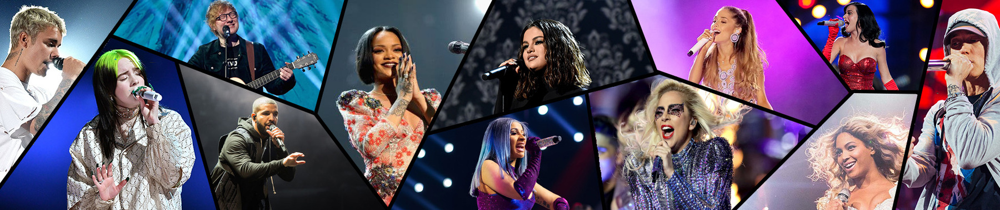
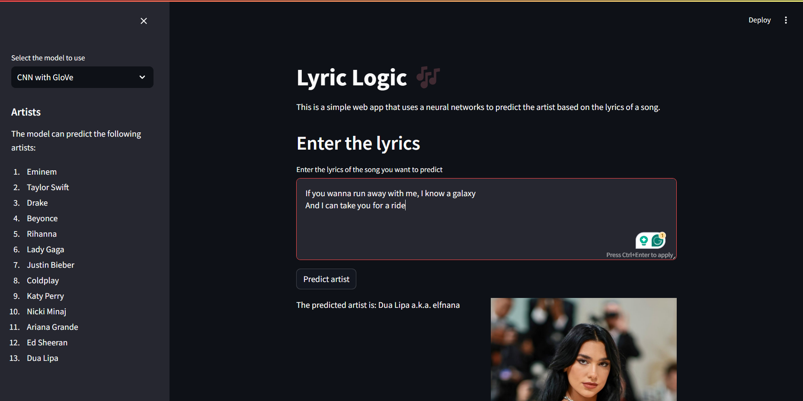

# Lyric-Logic

## Project Description

This project focuses on building a Lyric Classification Model using LSTM (Long Short-Term Memory) and CNN (Convolutional Neural Networks). The models' purpose is to identify which artist a given lyric belongs to. Users can input lyrics and the models will predict the associated artist, aligning with the course's focus on the practical implementation of Natural Language Processing (NLP) tasks.

## Methodology (Tech Stack)

-   **Python** 3.11.3 (64-bit)
    -   IPython 8.24.0
    -   Jupyter Notebook 8.6.1
-   **NumPy** 1.26.4 used for dealing with ndarrays.
-   **Pandas** 2.2.2 used for data manipulation and analysis.
-   **Matplotlib** 3.8.4 used for data visualization.
-   **TensorFlow** 2.16.1 used for building and training the model.
-   **Keras** 3.3.3 used for integrating TensorFlow and building the model.
-   **NLTK** 3.8.1 used for natural language processing tasks.
-   **Scikit-learn** 1.4.2 used for machine learning tasks.
-   **Streamlit** 1.35.0 used for building the web application.

All the above packages can be installed using the following command:

```bash
pip install -r requirements.txt
```

## Data-Set

The dataset used in this project is provided by Kaggle. The dataset is structured in the CSV file format, and is split into multiple files based on the artist. The dataset comprises approximately 21 files, with an overall size of approximately 21 MB.

The dataset can be downloaded from the following link: https://www.kaggle.com/datasets/deepshah16/song-lyrics-dataset/data

The dataset comprises the following columns:

-   **Artist:** The name of the artist.
-   **Title:** The title of the song.
-   **Album:** The album of the song.
-   **Date:** The release date of the song.
-   **Lyric:** The lyrics of the song.
-   **Year:** The year of the song.
-   **Unnamed: 0:** An additional column that can be ignored.

Data-set Cover:



## Project Structure

The project is structured as follows:

-   **Including Necessary Libraries:** Importing the necessary libraries found in the requirements.txt file.

-   **Loading the Dataset:** Loading the dataset from the CSV files and converting it to a Pandas DataFrame.

-   **Data Cleaning:** Removing unnecessary columns from the dataset, and then removing the records with missing and duplicate values.

-   **Data Visualization:** Visualizing the dataset using Matplotlib.

-   **Data Preprocessing & Feature Extraction:** Preprocessing the dataset by tokenizing the lyrics, removing stopwords, and converting the lyrics to sequences.

    -   **Tokenization**
    -   **Stopwords Removal**
    -   **Sequences Conversion**

-   **Building the Model:** Building the model using the LSTM and CNN models.

-   **Training the Model:** Training the model using the dataset and evaluating the model's performance.

    -   **CNN with GloVe Embedding**
    -   **CNN with learned embeddings**
    -   **LSTM with learned embeddings**

-   **Web Application:** Building a web application using Streamlit to allow users to predict artist based on the lyrics. (app.py)

    -   **Web Application Example:**

        

    -   The web application can be accessed by running the following command:

        ```bash
        streamlit run app.py
        ```

        or by visiting the following link: [Lyric-Logic Web Application](https://lyric-logic.streamlit.app/)

## References

-   [Kaggle: Song Lyrics Dataset](https://www.kaggle.com/datasets/deepshah16/song-lyrics-dataset/data)
-   [Streamlit Documentation](https://docs.streamlit.io/en/stable/)
